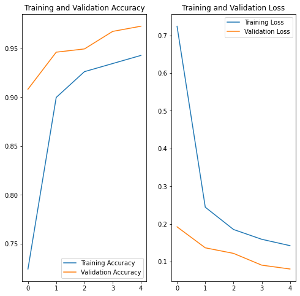
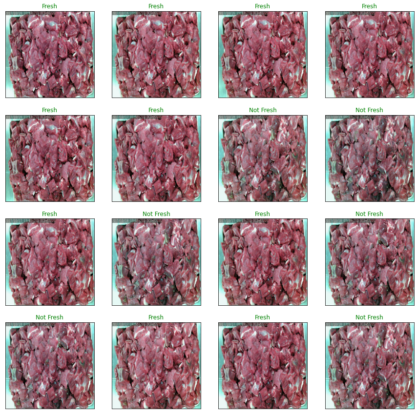

# Meat Quality Assesment API

- Implementation of [IEEE paper](https://ieeexplore.ieee.org/abstract/document/8946388)   
- Dataset freely distributed on [kaggle](https://www.microsoft.com/en-us/maps/choose-your-bing-maps-api)   
- Validation Set Accuracy **98%**
## Training Metrics

## Test Results

## API usage

```javascript

function Quality(filename) {
	var APIurl = ''
	var ourRequest = new XMLHttpRequest();
	ourRequest.open('POST', APIurl+'/predict/');
	var formData = new FormData();
	formData.append("img_file",file);
	ourRequest.send(formData);
	ourRequest.onload = function() {
		if (ourRequest.status >= 200 && ourRequest.status < 400) {
			var data = JSON.parse(ourRequest.responseText);
			console.log(data)
		} else {
			alert('Server Error')
		}
	}
}
```